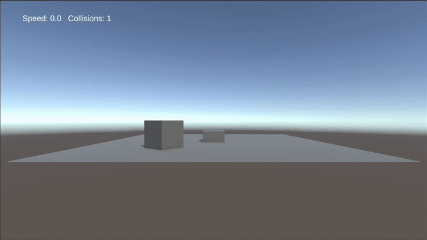
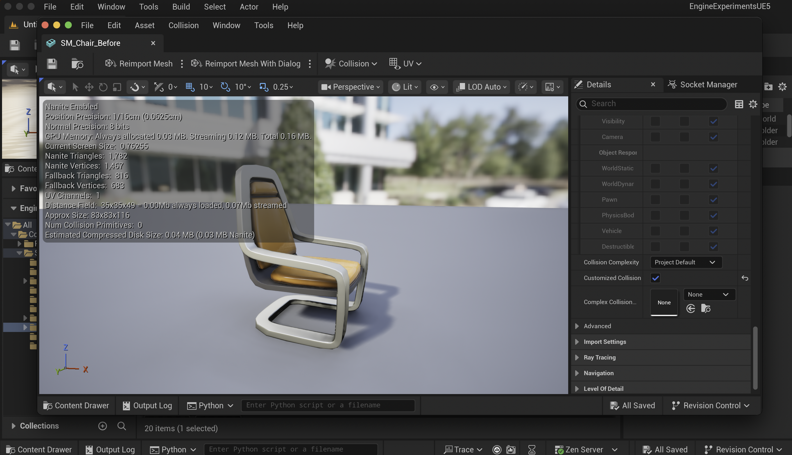

# Engine Experiments (Unity + UE5)

Small sandbox that shows (1) a Unity gameplay micro‑prototype and (2) Unreal (UE5) **Editor Automation** via Python + Editor Utility Widget.

<p align="center">
  
</p>

---

## Highlights

- **Unity (C#)** — simple movement controller using `Rigidbody`, on‑screen HUD (TextMeshPro) that live‑updates **speed** and **collision count**.
- **UE5 (Python + EUW)** — one‑click **batch tools** for Static Meshes:
  - **Rename to convention** (`SM_<BaseName>` for Static Meshes).
  - **Collision setup**: add simple collisions and set **Use Complex as Simple**.
  - **Save** all modified assets.
- Clean docs + screenshots of **before/after** and the **automation output**.

<p align="center">
  
  &nbsp;&nbsp;&nbsp;
  
</p>

---

## Repo Layout

```
engine-experiments/
├─ docs/
│  ├─ unity-demo.gif
│  ├─ ue-euw-demo.gif                  # (optional) Editor Utility Widget demo gif
│  ├─ outputlog-automation.png         # Output Log showing the Python run
│  ├─ before-settings.png              # UE5 mesh details before
│  └─ after-settings.png               # UE5 mesh details after
├─ unity/
│  └─ EngineExperimentsUnity/
│     ├─ Assets/
│     │  └─ Scripts/PlayerController.cs
│     └─ README-Unity.md               # per‑project notes
└─ unreal/
   └─ EngineExperimentsUE5/
      ├─ Content/
      │  ├─ Python/asset_tools.py      # Python automation
      │  └─ Editor/EUW_AssetTools.uasset (created in‑editor)
      └─ README-UE5.md                 # per‑project notes
```

> **Note**: Paths match what’s in this repo on disk; you can use different project names, but keep the subfolders (`unity/` and `unreal/`) to mirror this layout.

---

## Unity: quick start

**Tested:** Unity 6.0 (URP template) • TextMeshPro

1. Open **Unity Hub** → *Open* → select `unity/EngineExperimentsUnity`.
2. Open the scene you created (e.g., `Assets/Scenes/Demo.unity`).
3. Ensure **Player** GameObject has:
   - `Rigidbody` (non‑kinematic).
   - `PlayerController` (script below).
   - A `Text (TMP)` UI element in a Canvas. Drag it into the script’s **hudText** field.
4. Press **Play**.
   - **W/S** (or Up/Down) to move, **A/D** (or Left/Right) to rotate.
   - HUD shows `Speed: x.x   Collisions: n`.

**Script**: `Assets/Scripts/PlayerController.cs`
```csharp
using UnityEngine;
using UnityEngine.UI;

public class PlayerController : MonoBehaviour
{
    public float moveSpeed = 6f;
    public float rotateSpeed = 120f;
    public Text hudText; // assign in Inspector

    private Rigidbody rb;
    private int collisions = 0;

    void Awake() { rb = GetComponent<Rigidbody>(); }

    void Update()
    {
        float turn = Input.GetAxis("Horizontal") * rotateSpeed * Time.deltaTime;
        transform.Rotate(0f, turn, 0f);

        float forward = Input.GetAxis("Vertical") * moveSpeed;
        Vector3 vel = transform.forward * forward;
        rb.velocity = new Vector3(vel.x, rb.velocity.y, vel.z);

        if (hudText != null)
        {
            float speed = new Vector3(rb.velocity.x, 0f, rb.velocity.z).magnitude;
            hudText.text = $"Speed: {speed:0.0}   Collisions: {collisions}";
        }
    }

    void OnCollisionEnter(Collision collision) { collisions++; }
}
```

---

## UE5: quick start (Python + Editor Utility Widget)

**Tested:** Unreal Engine 5.6.x (Mac).  
**Plugins (enable and restart):**
- *Editor Scripting Utilities*
- *Python Editor Script Plugin*

### A) One‑off via Python console
1. In **Content Drawer**, select some meshes (e.g. `StarterContent/Props/*`).  
2. Open **Output Log** → `Python` tab.
3. Run:
```py
import sys
sys.path.append(r"/absolute/path/to/engine-experiments/unreal/EngineExperimentsUE5/Content/Python")
import asset_tools as at

at.rename_selected_assets(prefix="SM_")
at.setup_collision_selected()
at.save_modified_assets()
```
4. See `docs/outputlog-automation.png` for an example run.

### B) Editor Utility Widget (EUW)
1. Create an **Editor Utility Widget** (`Content/Editor/EUW_AssetTools`). Root = *Stack Box*.
2. Add three **Editor Utility Button** widgets; name them:
   - **Process Selected**
   - **Rename SM_…**
   - **Save Modified**
3. *Graph* tab:
   - Add **On Clicked (ProcessSelected)** → **Execute Python Command** node with
     ```py
     import sys; sys.path.append(r"/absolute/path/to/.../Content/Python"); import asset_tools as at
     at.setup_collision_selected()
     ```
   - Similarly wire other buttons to `rename_selected_assets(...)` and `save_modified_assets()`.
4. Run the EUW: **Tools → Editor Utility Widgets → EUW_AssetTools**.

---

## Python: `asset_tools.py` (excerpt)

```py
import unreal, re

def _sanitize_base(name: str) -> str:
    base = re.sub(r'[\s\-]+', '_', name)
    return re.sub(r'[^A-Za-z0-9_]', '', base)

def get_selected_assets():
    assets = unreal.EditorUtilityLibrary.get_selected_assets()
    if not assets:
        unreal.log_warning("No assets selected.")
    return assets

def rename_selected_assets(prefix: str = "SM_"):
    assets = get_selected_assets()
    count = 0
    for a in assets:
        old_path = a.get_path_name()
        pkg_path, old_name = old_path.rsplit("/", 1)
        base = _sanitize_base(a.get_name())
        is_sm = isinstance(a, unreal.StaticMesh)
        new_name = base if (not is_sm or base.startswith(prefix)) else f"{prefix}{base}"
        if new_name == old_name:
            unreal.log(f"[rename] unchanged: {old_path}"); continue
        if unreal.EditorAssetLibrary.rename_asset(old_path, f"{pkg_path}/{new_name}"):
            count += 1; unreal.log(f"[rename] {old_path} -> {pkg_path}/{new_name}")
        else:
            unreal.log_warning(f"[rename] failed: {old_path}")
    unreal.log(f"[rename] total renamed: {count}")

def setup_collision_selected():
    assets = get_selected_assets(); updated = 0
    for a in assets:
        if isinstance(a, unreal.StaticMesh):
            try:
                unreal.EditorStaticMeshLibrary.add_simple_collisions(
                    a, shape_type=unreal.CollisionShapeType.SPHERE)
            except Exception:
                # UE 5.6 alternate API
                unreal.EditorStaticMeshLibrary.add_simple_collisions(
                    a, shape=unreal.SimpleCollisionShapeType.SPHERE)
            # Prefer complex as simple
            a.set_editor_property("collision_complexity", unreal.CollisionTraceFlag.CTF_USE_COMPLEX_AS_SIMPLE)
            updated += 1; unreal.log(f"[collision] updated: {a.get_path_name()}")
    unreal.log(f"[collision] total updated: {updated}")

def save_modified_assets():
    # Fallback to saving /Game if API differences occur
    unreal.EditorAssetLibrary.save_directory("/Game")
    unreal.log("[save] done")
```

> The repo contains the full, working version used to produce the screenshots.

---

## Demos & Evidence

- Unity: `docs/unity-demo.gif`
- UE5 (optional): `docs/ue-euw-demo.gif`
- UE5 **Output Log** during automation: `docs/outputlog-automation.png`
- UE5 **Before/After** settings screenshots: `docs/before-settings.png`, `docs/after-settings.png`

---

## Troubleshooting

- **Python tab not visible** → Output Log ▸ gear icon ▸ enable *Python*. Confirm plugins are enabled and restart the editor.
- **Rename says “asset already exists”** → the selected meshes already match the convention (e.g., `SM_Chair`). That’s expected; the tool logs “unchanged”.  
- **Can’t save** → disable/ignore source control for this repo or convert to *Uncontrolled Changelists*.
- **Colliders not visible** → In the Static Mesh Editor, Viewport ▸ *Collision* ▸ **Simple Collision**.

---

## Requirements

- **Unity**: Unity Hub + Unity 6.x (URP). Packages: TextMeshPro (auto‑imported).
- **Unreal**: UE 5.6.x with *Editor Scripting Utilities* + *Python Editor Script Plugin*. Starter Content optional.

---

## License

MIT — do whatever you’d like. Attribution appreciated.